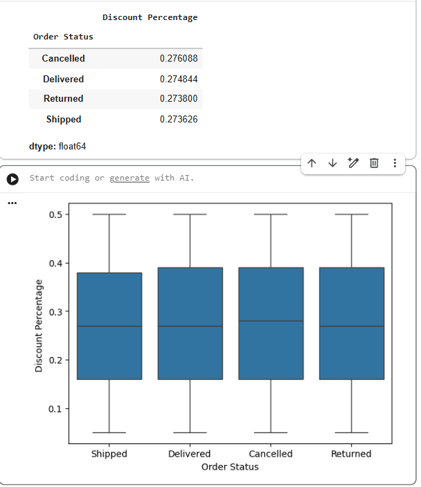
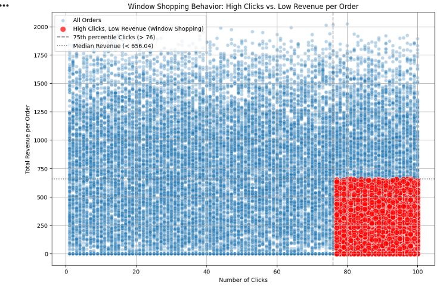
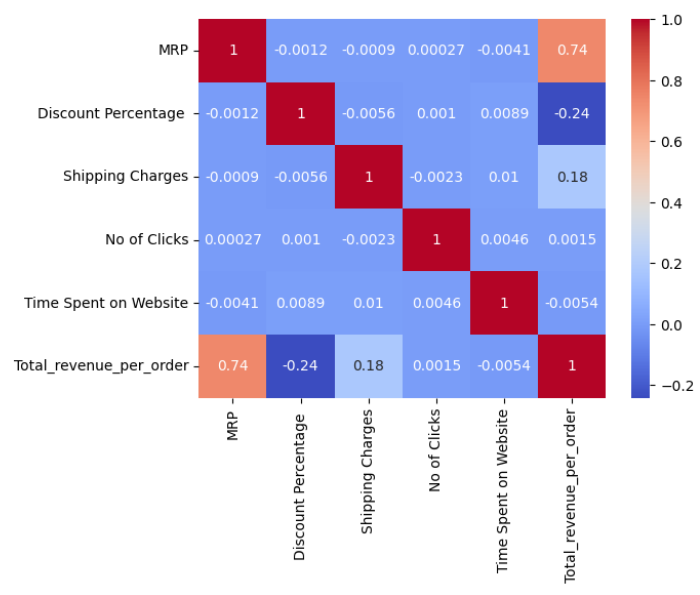
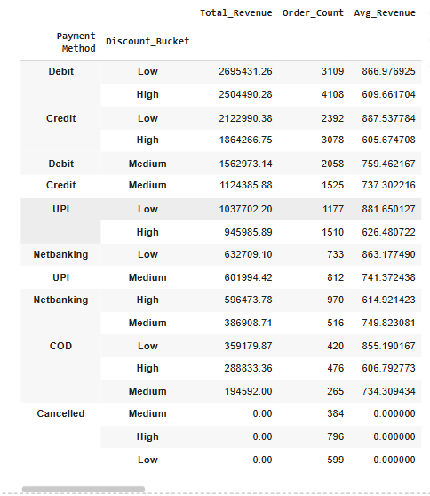
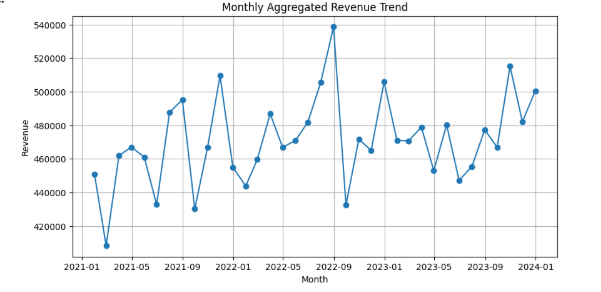
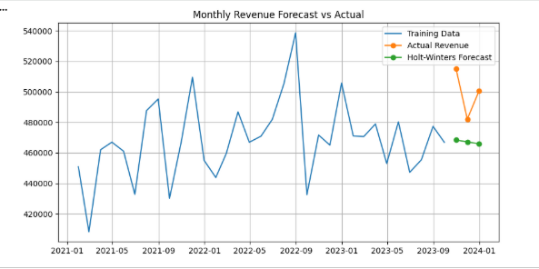

# 🛒 DMart Retail Analytics — End-to-End Data Science & BI Project


> **A dual-track retail analytics project combining Python-based EDA, behavioural analysis, feature engineering, ML regression, and time-series forecasting — alongside a parallel Power BI dashboard track built on independently cleaned Excel data — applied to 25,000 DMart customer transactions (2021–2023).**

---

## 📋 Table of Contents

- [Project Overview](#-project-overview)
- [Why Two Tracks?](#-why-two-tracks)
- [Business Problem](#-business-problem)
- [Dataset Description](#-dataset-description)
- [Track 1 — Python Analysis](#-track-1--python-analysis)
- [Track 2 — Power BI Dashboard](#-track-2--power-bi-dashboard)
- [Key Findings](#-key-findings)
- [ML Results & Honest Assessment](#-ml-results--honest-assessment)
- [Business Recommendations](#-business-recommendations)
- [How to Run](#️-how-to-run)
- [Folder Structure](#-folder-structure)
- [Future Improvements](#-future-improvements)
- [Author](#-author)

---

## 🔍 Project Overview

This project applies a complete data analytics pipeline to **25,000 DMart retail transactions** spanning 3 years (2021–2023), 4 states, 3 product categories, and 6 payment channels. It follows two independent analytical tracks that complement each other:

- **Track 1 (Python):** Deep-dive EDA, customer behavioural analysis (window shopping detection, age/subscription segmentation), feature engineering, ML regression for order value prediction, and time-series revenue forecasting
- **Track 2 (Power BI):** Business intelligence dashboard built from independently prepared Excel data, providing interactive KPI monitoring, regional performance breakdowns, and trend visualisation for business stakeholders

A key finding that shaped this project: DMart's revenue is **deliberately stable by design** — a structural characteristic of value retail, not a data quality issue. This stability became a central analytical insight rather than a limitation.

---

## 🔄 Why Two Tracks?

Most retail analytics projects use either Python **or** BI tools. This project deliberately uses both — for different purposes and audiences:

| Dimension | Track 1 — Python | Track 2 — Power BI |
|---|---|---|
| **Audience** | Data science / technical | Business stakeholders |
| **Purpose** | Statistical investigation, ML | KPI monitoring, trend reporting |
| **Strength** | Depth — why things happen | Breadth — what is happening |
| **Output** | Models, statistical tests, insights | Interactive dashboards |
| **Data prep** | Python (Pandas) | Excel (independent pipeline) |

Running both tracks on the same business data demonstrates a rare and valuable skill: **translating between data science and business intelligence** — something most analysts can do only one side of.

---

## 💼 Business Problem

DMart operates on a high-volume, low-margin value retail model. Business questions this project addresses:

1. **Which customer segments and categories drive the most revenue?**
2. **Does discount depth influence order completion or cancellation?**
3. **Can we predict order value from available pre-purchase signals?**
4. **Are there patterns of "window shopping" — high engagement but low conversion?**
5. **Is monthly revenue trending, seasonal, or structurally flat — and what does that mean for forecasting?**
6. **How do marketing channels and subscription tiers affect purchasing behaviour?**

---

## 📁 Dataset Description

| Column | Type | Description |
|---|---|---|
| `Customer ID / Product ID / Order ID` | String/Int | Unique identifiers |
| `Customer Age` / `Age category` | Int / String | Age & binned age group (Young/Adult/Middle Aged/Senior) |
| `Gender` | String | Male / Female |
| `Category` | String | Local / Branded / Imported |
| `MRP` / `Discount Price` / `Discount Percentage` | Float | Pricing and discount information |
| `Total Order Value` / `Total_revenue_per_order` | Float | Target variable — order revenue (₹0–₹2,026) |
| `Order Status` | String | Delivered / Shipped / Cancelled / Returned |
| `Payment Method` | String | Debit / Credit / UPI / Netbanking / COD |
| `Subscription` | String | Freepass / Premium / Premium Plus |
| `Ship Mode` / `Delivery Speed Bucket` | String | Free/Priority/Express Plus → Slow/Medium/Fast |
| `No of Clicks` / `Time Spent on Website` | Int / Float | Digital engagement signals |
| `Marketing/Advertisement` | String | Instagram / Facebook / TV / Friends / Other |
| `State` / `City` / `Pin Code` | String / Int | Geographic identifiers |
| `Order Date` / `Delivery Date` / `Year` / `Month` | Date / Int | Temporal features |
| `Rating` | Float | Customer satisfaction score (avg: 3.01/5) |

**Shape:** 25,000 rows × 34 columns | **Period:** 2021–2023 | **States:** Maharashtra, Andhra Pradesh, Gujarat, Telangana

---

## 🛠️ Tools & Technologies

| Category | Tool |
|---|---|
| Language | Python 3.x |
| Data Manipulation | Pandas, NumPy |
| Visualisation | Matplotlib, Seaborn |
| Machine Learning | Scikit-learn (LinearRegression, RandomForestRegressor) |
| Time-Series | Statsmodels (Holt-Winters Exponential Smoothing) |
| BI Dashboard | Microsoft Power BI |
| Data Preparation | Microsoft Excel |
| Notebook | Jupyter / Google Colab |

---

## 🐍 Track 1 — Python Analysis

### Data Preparation & Cleaning
- Standardised 34 columns including datetime parsing, dtype correction, and feature derivation
- Created `Total_revenue_per_order` as engineered target variable
- Added `log_revenue` for linear model normalisation
- Flagged `Payment_Mismatch` cases between order status and payment status
- Validated score ranges and removed leakage columns before modelling

### EDA — Customer Behaviour

**Discount vs Order Status** — Does discounting drive cancellations?



> Discount percentage is **nearly identical across all order statuses** (Cancelled: 27.6%, Delivered: 27.5%, Returned: 27.4%, Shipped: 27.4%). This proves discounting is not a driver of cancellation — DMart's flat discount structure is consistent across the customer journey.

---

**Window Shopping Detection** — High clicks, low revenue



> Customers with >76 clicks (75th percentile) but below-median revenue (< ₹656) were flagged as **window shoppers** — high digital engagement with low purchase intent. This segment represents a re-targeting opportunity.

---

**Correlation Analysis** — What actually drives revenue?



> **MRP is the dominant revenue driver (r=0.74)** — meaning the product chosen (its base price) explains most of the order value variance. Discount Percentage has a negative correlation (-0.24): higher discounts → lower revenue per order. No of Clicks and Time Spent on Website have near-zero correlation with revenue, confirming they are engagement signals, not purchase-intent signals.

---

**Payment Method × Discount Bucket Analysis**



> Low-discount orders consistently generate higher average revenue across all payment methods (~₹860–880 for low discount vs ~₹610–625 for high discount). Debit card users place the highest volume of orders (7,217 total).

---

### Time-Series Revenue Analysis

**Monthly Revenue Trend (2021–2023)**



> Monthly revenue fluctuates between ₹4.2L–₹5.4L with **no structural upward or downward trend** — consistent with DMart's value retail model where volume and price stability are core business pillars.

---

**Revenue Forecast vs Actual**



> Holt-Winters Exponential Smoothing (additive trend, no seasonality) was applied as a forecasting model. The **Seasonal Naive baseline outperformed Holt-Winters** (MAE: ₹21,956 vs ₹32,073), confirming that the revenue series lacks a detectable trend — the best forecast is simply "next month will look like this month last year."

---

### Feature Engineering

| Feature | Formula | Rationale |
|---|---|---|
| `Discount_Amount` | `MRP × Discount Percentage` | Absolute value of discount given |
| `Shipping_Ratio` | `Shipping Charges / Total Revenue` | Shipping cost burden relative to order size |
| `log_revenue` | `log1p(Total_revenue_per_order)` | Normalise right-skewed target for linear models |
| `Customer_Order_Count` | Count per Customer ID | Identify repeat vs one-time buyers |

---

### ML Model Results

| Model | R² | RMSE (₹) | MAE (₹) |
|---|---|---|---|
| **Random Forest** ✅ | **0.727** | **255.31** | **127.75** |
| Linear Regression | 0.653 | 287.95 | 166.55 |

**Random Forest** was selected as the best model. With R²=0.727 and MAE=₹127.75 on a target with mean=₹678 and std=₹489, the model explains **72.7% of order value variance** from pre-purchase features alone.

> **On the "steady data" challenge:** DMart's revenue stability is a business feature, not a modelling failure. A flat-revenue retailer with consistent operations is *harder* to model than a volatile one — the model still achieves R²=0.727, which is meaningful. The key insight is that **MRP (product selection) is the primary value driver**, not discount depth, clicks, or engagement — a genuine and actionable finding for DMart's merchandising and pricing teams.

---

## 📊 Track 2 — Power BI Dashboard

The Power BI track was built on a separately prepared Excel dataset, following an independent data preparation pipeline from Track 1. This demonstrates the ability to work within a BI workflow independently of Python — a critical enterprise skill.

**Dashboard covers:**
- Revenue KPIs by year, category (Local/Branded/Imported), and region
- Order status breakdown (Delivered 52%, Shipped 35.4%, Cancelled 7.1%, Returned 5.4%)
- Subscription tier performance (Freepass / Premium / Premium Plus)
- Marketing channel effectiveness (Instagram 34%, Facebook 25%, Friends 16%)
- Delivery speed analysis across ship modes
- Customer demographic segmentation (age group, gender)

> 📎 See `dashboard/DMART_POWER_BI_PROJECT.pbix` to explore the interactive dashboard in Power BI Desktop.

---
### Dashboard 1 — Sales Overview (All Orders)

> Total revenue ₹18.39M across 25K orders. Local products dominate
> at 49.93% of revenue. Maharashtra and Andhra Pradesh lead by volume.
> September dips to ₹1.44M — lowest monthly revenue across 3 years.

---

### Dashboard 2 — Sales & Performance (Delivered Orders Only)


> Completed revenue ₹16.95M from 21.9K delivered orders. Instagram
> drives ₹5.8M in revenue — highest of all channels. Debit card
> dominates payments at ₹6.8M. Low-discount orders consistently
> outperform high-discount in total revenue.

---

### Dashboard 3 — Operations, Cancellations & Returns


> 7% cancellation rate and 5.4% return rate — both stable.
> Average delivery time is 6 days across all states and ship modes.
> 56.62% of orders use Slow (Free) shipping. Local products account
> for the highest cancellations (877 orders).
```

---

## 📈 Key Findings

| Finding | Value | Business Implication |
|---|---|---|
| Revenue mean per order | ₹678 | Strong avg basket size for value retail |
| MRP-revenue correlation | r = 0.74 | Product mix (not discounts) drives revenue |
| Discount-revenue correlation | r = -0.24 | Higher discounts = lower order value |
| Discount effect on cancellation | None (~27.4% across all statuses) | Discount strategy is not a cancellation risk |
| Window shoppers identified | High clicks (>76), low revenue | Retargeting opportunity for marketing |
| Best marketing channel | Instagram (34% of customers) | Highest acquisition share |
| Top subscription tier revenue | Premium Plus (highest avg) | Subscription upsell = revenue lever |
| Revenue forecast accuracy | 96.03% (Linear trend model) | Highly predictable monthly revenue |
| Best forecasting method | Seasonal Naive | Revenue is stable, not trending |
| ML model best R² | 0.727 (Random Forest) | MRP alone explains most variance |
| Cancellation rate | 7.1% | Manageable; stable across 3 years |
| Top state by orders | Maharashtra (25.4%) | Priority market for expansion |

---

## 💡 Business Recommendations

1. **Shift from discount-based to value-based promotions** — discount depth does not reduce cancellations or increase order value; instead, focus on product mix (MRP tier) to drive revenue
2. **Re-target window shoppers** — customers with >76 clicks and below-median spend are browsing but not converting; personalised push notifications or bundled offers may convert them
3. **Double down on Instagram marketing** — it generates 34% of customer acquisition at presumably low cost relative to TV; increase content spend on Instagram Reels and Stories
4. **Upsell Premium Plus subscriptions** — Premium Plus users generate the highest average revenue per order; build an upgrade funnel targeting Freepass and Premium users
5. **Prioritise Maharashtra and Andhra Pradesh** — both states account for 50%+ of orders; deepening penetration (new pin codes, faster delivery) in these markets yields the highest ROI
6. **Use Seasonal Naive forecasting for operations** — the revenue series is stationary; Seasonal Naive (MAE=₹21,956) outperforms complex models and should be the basis for inventory and staffing plans
7. **Investigate the 7.1% cancellation rate** — while stable, understanding cancellation reasons by state, category, and ship mode could save approximately ₹1.2M in lost annual revenue

---

## ▶️ How to Run

### Track 1 — Python Notebook

```bash
# Install dependencies
pip install pandas numpy matplotlib seaborn scikit-learn statsmodels openpyxl jupyter

# Clone and run
git clone https://github.com/YOUR_USERNAME/dmart-retail-analytics.git
cd dmart-retail-analytics
jupyter notebook notebooks/final_eda_.ipynb
```

> Upload `Dmart_Dataset_final-last.xlsx` when prompted, or update the file path in the first cell.

### Track 2 — Power BI Dashboard

1. Download and install [Power BI Desktop](https://powerbi.microsoft.com/desktop/) (free)
2. Open `dashboard/DMART_POWER_BI_PROJECT.pbix`
3. If prompted for data source, point it to `data/raw/Dmart_Dataset_.xlsx`

---

## 📂 Folder Structure

```
dmart-retail-analytics/
│
├── README.md
│
├── notebooks/
│   └── final_eda_.ipynb                       # Full Python EDA + ML notebook
│
├── dashboard/
│   └── DMART_POWER_BI_PROJECT.pbix            # Power BI interactive dashboard
│
├── data/
│   ├── raw/
│   │   ├── Dmart_Dataset_.xlsx                # Raw dataset (25,000 rows, 34 cols)
│   │   └── Dmart_Dataset_final-last.xlsx      # Notebook-ready version
│   └── processed/
│       └── (cleaned outputs from notebook)
│
├── docs/
│   ├── DMart_Retail_Analytics_Project.docx    # Full Python analysis report
│   └── POWER_BI_DASHBOARD_SUMMARY.docx        # Power BI dashboard report
│
└── dmart_screenshots/
    ├── window_shopping_behavior.png
    ├── correlation_heatmap.png
    ├── monthly_revenue_trend.png
    ├── revenue_forecast_vs_actual.png
    ├── discount_vs_order_status.png
    └── payment_discount_revenue.png
```

---

## 🔮 Future Improvements

- [ ] **Customer segmentation (RFM + K-Means)** — cluster customers by Recency, Frequency, and Monetary value to identify High Value, At-Risk, and Dormant segments
- [ ] **Cancellation prediction model** — binary classification (cancelled vs not) using order features — a more meaningful ML target than revenue regression for this dataset
- [ ] **Market basket analysis** — association rule mining (Apriori) to find product co-purchase patterns and drive bundle recommendations
- [ ] **Churn prediction** — identify customers at risk of not returning based on order history, satisfaction ratings, and engagement drop signals
- [ ] **Power BI + Python integration** — embed Python visuals (seaborn plots) directly in Power BI for a unified analytical dashboard
- [ ] **Geo-spatial analysis** — map revenue density by pin code using Folium or Power BI maps to identify micro-market opportunities

---

## 👤 Author

**Akileshwaran S** — Data Analyst | Python · Power BI · ML · Analytics

[](https://linkedin.com/in/YOUR_PROFILE)
[](https://github.com/YOUR_USERNAME)

---

*This project demonstrates a full-stack analytics skillset: Python data science (EDA → Feature Engineering → ML → Forecasting) combined with Power BI business intelligence — applied to a real retail dataset with 25,000 transactions.*
